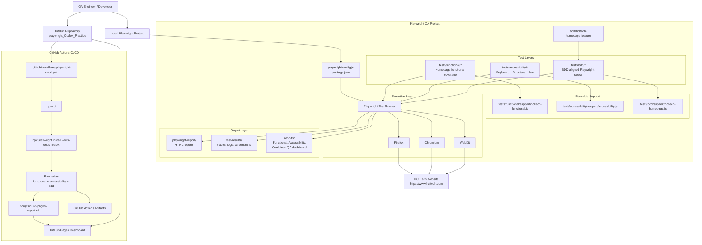
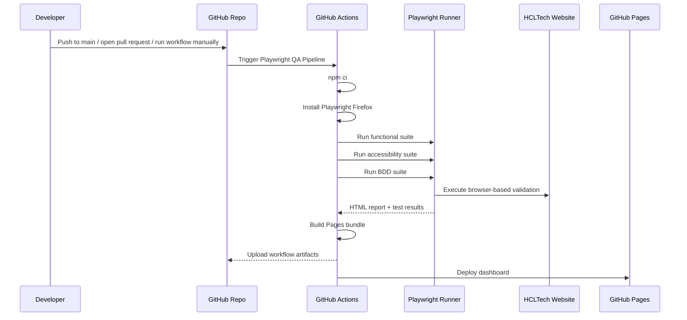

# Project Architecture Diagram

This diagram shows how the HCLTech Playwright QA project is organized across test authoring, execution, reporting, and CI/CD.

## System Architecture

## CI/CD Execution Flow

## Notes

- `Firefox` is the main CI baseline because it has been the most stable browser for this target site.
- `Chromium` and `WebKit` remain available for local or broader cross-browser validation.
- The `reports/` folder stores hand-crafted QA summaries, while `playwright-report/` contains generated Playwright HTML output.
- The CI/CD pipeline publishes a lightweight dashboard bundle to GitHub Pages so the latest run is easier to review.
